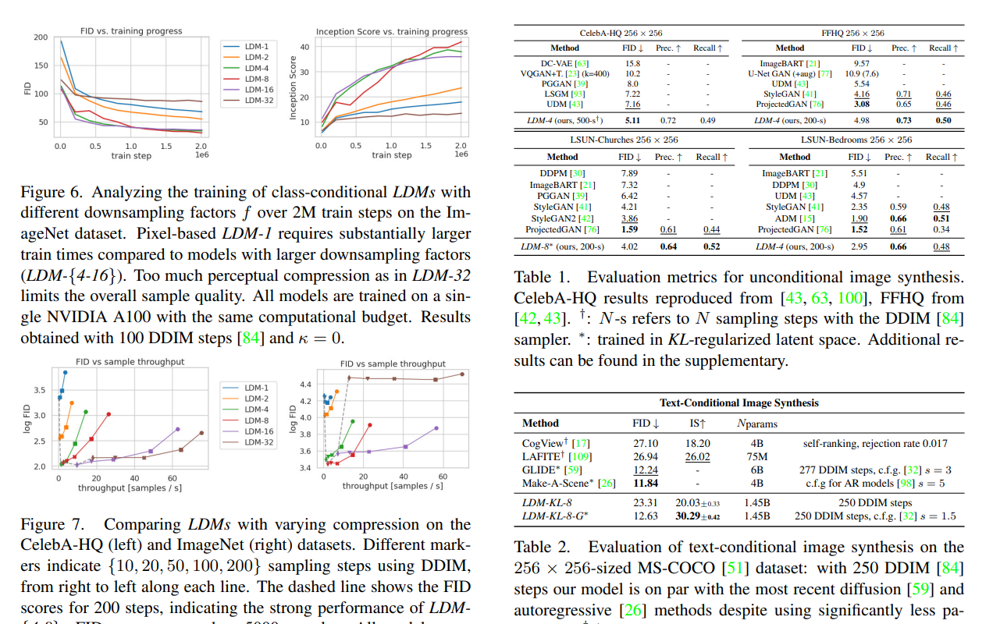

# 서유기 

## 1. 리더보드 준비

리더보드 보다는 `인공지능 모델 성능 대회`를 한다고 생각하면 좋을 것 같습니다  
무술대회가 성공적으로 진행되기 위해서는 다음의 2가지 요소가 필수적이라고 생각을 합니다  

* 공정성 
* 기준

### 기준

이러한 요소들이 초금은 더 나아가서 논문을 이해하는 데 도움이 된다고 생각을 함  


> https://arxiv.org/pdf/2112.10752.pdf

기준에 따라서 좋은 모델이 다름  
임베디드 보드에 이식을 해야 하는 상황이라면 적은 메모리에서 돌아가야하는 것이 좋은 것이고    
복싱 데이터를 처리해야 한다면 최대한 빠르게 처리해야 하는 모델이 좋음   
어떤 기준이 우리의 프로젝트에 적합한지를 볼 수 있는 시야가 필요함   

일반적으로 사용하는 것이 `Confusion Matrix`를 비록한 다양한 mertic를 사용함   

> https://leedakyeong.tistory.com/entry/%EB%B6%84%EB%A5%98-%EB%AA%A8%EB%8D%B8-%EC%84%B1%EB%8A%A5-%ED%8F%89%EA%B0%80-%EC%A7%80%ED%91%9C-Confusion-Matrix%EB%9E%80-%EC%A0%95%ED%99%95%EB%8F%84Accuracy-%EC%A0%95%EB%B0%80%EB%8F%84Precision-%EC%9E%AC%ED%98%84%EB%8F%84Recall-F1-Score

우리의 타이타닉 데이터셋에 적용하면 다음과 같음  

| 모델의 예측값 | 실제 데이터셋의 값 | 혼돈행렬 |
|---------------|--------------------|----------|
| 0             | 0                  | TN       |
| 1             | 0                  | FP       |
| 0             | 1                  | FN       |
| 1             | 1                  | TP       |

이러한 것에 대한 의미나 맥락은 실제 프로젝트에 따라서 다르게 봐야해서 지금은 그런갑다 하고 넘어갈려고 합니다
나중에 실제 프로젝트에서 어떤 의미를 가지는지 자세히 파악 예정입니다

이러한 metric들을 기반으로 loss를 정의하기도 합니다

### 공정성

대회에서 공정성이 포함되어 있는 것은 당연하다고 보는데 이런거는 재미가 없습니다 
조금은 다르게 접근을 해보고자 합니다

어떤 대회에서 우승을 한다면 막대한 부와 명예가 따라옵니다    
그래서 다들 이 악물고 우승하려고 노력을 하려고 합니다  

하지만 사람이란게 좋은 사람만 있는게 아니라 다른 사람들을 사기치면서 사는 사람들도 존재합니다  

올림픽에서는 실제로 우승을 하기 위해서 도핑이라는 불법적인 행위를 통해서라도 우승하려고 합니다  
이게 기계학습에서도 똑같이 일어날 수도 있습니다  

조금 더 현실성 있는 예제로 고등학생과 수능을 예시로 들어서 설명해보고자 합니다  

고등학생을 모델에 , 고교생활을 train data , test는 수능에 비유할 수 있습니다  

학생의 목표는 고등학교에서 공부를 해서 수능에서 좋은 성적을 받는 것입니다  
모델로 표현을 하면 trian data에서 학습을 통해서 일반적인 상황에서도 좋은 성능을 보이고자 합니다 

만약에 수능시험지가 유출이 된다면
누구나 고교 공부보다는 수능 시험지 답지만 달달 외우게 될 것 같습니다
이는 우리가 학생에 바라는 수학능력 향상이라는 목적과 부합하지 않습니다 

이러한 것을 데이터 유출(data leakage)라고 합니다

```python
from sklearn.model_selection import train_test_split

X = titanic_data.drop(['Age'], axis=1)
y = titanic_data['Age']

X_train, X_test, y_train, y_test = train_test_split(X, y, test_size=0.2, random_state=42)
```

이 코드는 채널지기님이 보여주신 코드인데
여기에 앞서 설명한 것들이 잘 포함되어 있다고 보입니다

X에서 target값인 'Age'로 분리하는 것 처럼
target값에 대해서 분리가 안된 것을  target leakage를라고 합니다  

train , test를 분리가 안된 것을  train test leakage라고합니다 


### Next
이제 각자 최대한 중복이 안되는 선에서 각자 원하는 모델을 가지고
기준과 공정성을 포함해서 실제 모델의 성능을 확인해보고자 합니다
위 data split을 기준으로 test_data에 대해서 `precision` , `recall` , `f1-score`를 기준으로 각 모델의 성능을 평가하자고 합니다

